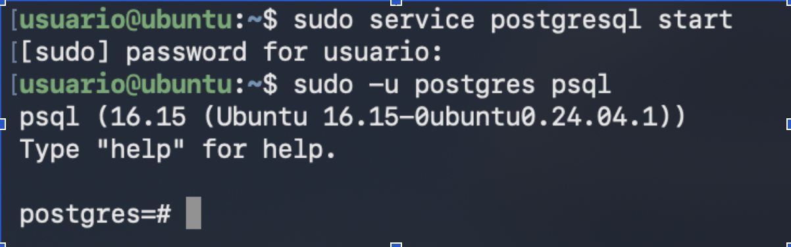
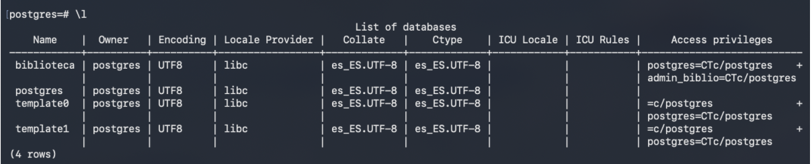
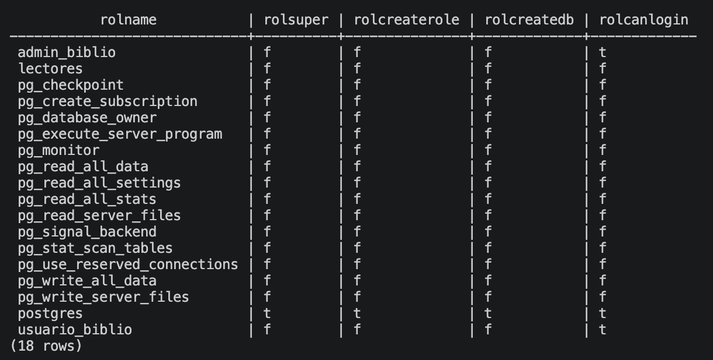

# INFORME PRÁCTICA 1: FUNDAMENTOS POSTGRESQL

## Autenticación e inicio en PostgreSQL mediante terminal

Para iniciar el servicio del sistema gestor de la base de datos y poner en marcha el motor de la BBDD en segundo plano para que se puedan aceptar conexiones, es necesario ejecutar el siguiente comando:

```bash 
sudo service postgresql start 
```

Tras haber activado el servicio se procede a iniciar una sesión de autenticación e interacción empleando el siguiente comando:


```bash 
sudo -u postgres psql
```

Este comando actúa de la siguiente forma, le indica al sistema que ejecute una orden de identificación como el usuario del sistema llamada, en este caso, postgres (es el usuario administrador que crea la instalación de PostgreSQL en Linux por defecto). La parte final del comando, psql, hace referencia al inicio de la consola o cliente interactivo de línea de comandos de PostgreSQL.

A efectos prácticos, tras la ejecución de estos comandos, se cambiará el prompt de la terminal a postgres=#, indicando que ya se puede escribir instrucciones de administración y consultas SQL.



## Creación y configuración de la base de datos

1. ### Creación de la base de datos

Primero nos dedicaremos a crear la base de datos sobre la que vamos a trabajar, en este caso, la llamaremos biblioteca. Para realizar este paso usaremos los siguientes comandos, hay dos alternativas:

Creación sin entrar en el servicio de postgreSQL, directamente desde la terminal
Usaremos un comando que proporciona PostgreSQL que sería el siguiente: 

```bash
createdb biblioteca
```

Creación dentro del servicio de PostgreSQL, aplicando directamente instrucciones de SQL
La instrucción necesaria sería: 

```SQL
CREATE DATABASE biblioteca;
```

En este informe emplearemos la segunda manera directamente dentro del servicio de PostgreSQL, cabe aclarar que este paso se ha realizado previamente en las horas de prácticas tutorizadas por lo que no es posible adjuntar una captura de pantalla de la ejecución de las instrucciones dentro del entorno pero indicaremos los comandos ejecutados y listaremos los elementos creados.

```bash
postgres=# CREATE DATABASE biblioteca;
CREATE DATABASE
```

Tras esto la base de datos ya ha sido creada con el identificador de “biblioteca” y con el comando \l de psql podemos observar si se ha creado correctamente



Como comentamos anteriormente esta parte ha sido avanzada en horario de prácticas tutorizadas por lo que podemos observar que hay un usuario “admin_biblio” que tiene permisos de acceso privilegiados que más adelante indagaremos en su creación. Esto era necesario debido a que si intentamos conectarnos a dicha base de datos ya creada con este comando:

```bash
usuario@ubuntu:~$ sudo psql -d biblioteca -U postgres
psql: error: connection to server on socket "/var/run/postgresql/.s.PGSQL.5432" failed: FATAL:  Peer authentication failed for user "postgres"
```

Nos saltaba el mensaje de error que observamos, este error tiene que ver con la parte del comando “-U postgres” al ejecutar ese comando el sistema comprueba que usuario lo está ejecutando (root) e intentamos conectarnos al usuario de PostgreSQL (postgres) por lo que la autenticación entre pares (peer) es inválida y rechaza la conexión (root != postgres). Por lo que, a partir de aquí nos involucramos en la creación de usuarios y asignación de permisos.

2. ### Creación de usuarios

En este apartado como comentamos anteriormente dedicaremos el tiempo a definir los usuarios, roles y distintos permisos necesarios para el correcto funcionamiento de nuestra BBDD.

Principalmente crearemos dos usuarios, el primero admin_biblio que tendrá permisos de administrador sobre la base de datos y luego, usuario_biblio con permisos de solo lectura.

```bash
postgres=# \c biblioteca
You are now connected to database "biblioteca" as user "postgres".
```
```sql
biblioteca=# CREATE ROLE admin_biblio WITH LOGIN PASSWORD 'adminpass';
CREATE ROLE
biblioteca=# CREATE ROLE usuario_biblio WITH LOGIN PASSWORD 'usuariopass';
CREATE ROLE
```

Con esto ya hemos creado los dos usuarios, cabe destacar que en el primer comando lo que hacemos es conectarnos a la base de datos para trabajar sobre ella. A continuación, otorgamos permisos de administrador al usuario "admin_biblio"

```sql
biblioteca=# GRANT ALL PRIVILEGES ON DATABASE biblioteca TO admin_biblio;
GRANT
```

Creamos el rol de "lectores" dentro de la BBDD con permisos de lectura y asignamos al usuario "usuario_biblio" a dicho rol

```sql
biblioteca=# CREATE ROLE lectores NOLOGIN;
CREATE ROLE
biblioteca=# GRANT lectores TO usuario_biblio;
GRANT ROLE
biblioteca=# GRANT SELECT ON ALL TABLES IN SCHEMA public TO lectores;
GRANT
```

Con el grant para otorgar los permisos de lectura al rol de lectores lo que conseguimos es que para todas las tablas existentes hasta el momento se le otorguen permisos de lectura pero no para futuras tablas creadas por lo que la solución a esto es la siguiente: 

```sql
biblioteca=# ALTER DEFAULT PRIVILEGES IN SCHEMA public GRANT SELECT ON TABLES TO lectores;
ALTER DEFAULT PRIVILEGES
```

Con este comando listaremos todos los usuarios existentes y sus permisos:

```sql
biblioteca=# SELECT rolname, rolsuper, rolcreaterole, rolcreatedb, rolcanlogin FROM pg_roles ORDER BY rolname;
```



Ahora procederemos al cambio de contraseña del rol existente "usuario_biblio"

```sql
biblioteca=# ALTER ROLE usuario_biblio WITH PASSWORD 'usuario_biblio';
ALTER ROLE
```

Ahora usaremos una capa de seguridad para que el usuario "usuario_biblio" no pueda realizar ningún tipo de borrado de registros

```sql
biblioteca=# REVOKE DELETE ON ALL TABLES IN SCHEMA public FROM usuario_biblio;
REVOKE
biblioteca=# ALTER DEFAULT PRIVILEGES IN SCHEMA public REVOKE DELETE ON TABLES FROM usuario_biblio;
ALTER DEFAULT PRIVILEGES
```

3. ### Creación de la tablas 

Se centra en definir la estructura relacional de la base de datos biblioteca especificando las tres tablas, sus claves primarias y sus claves foráneas

```sql
biblioteca=# CREATE TABLE autores(id_autor SERIAL PRIMARY KEY, nombre TEXT NOT NULL, nacionalidad TEXT);
CREATE TABLE
biblioteca=# CREATE TABLE libros (
    id_libro SERIAL PRIMARY KEY,
    titulo TEXT NOT NULL,
    año_publicacion INT,
    id_autor INT REFERENCES autores(id_autor)
);
CREATE TABLE
biblioteca=# CREATE TABLE prestamos (
    id_prestamo SERIAL PRIMARY KEY,
    id_libro INT REFERENCES libros(id_libro) ON DELETE CASCADE,
    fecha_prestamo DATE NOT NULL,
    fecha_devolucion DATE,
    usuario_prestatario TEXT NOT NULL
);
CREATE TABLE
```

4. ### Inserción de datos

Insertamos los datos dentro de las tablas correspondientes para darles valores reales

```sql
biblioteca=# INSERT INTO autores (nombre, nacionalidad) VALUES
('Gabriel García Márquez', 'Colombiana'),
('Miguel de Cervantes', 'Española'),
('George Orwell', 'Británica'),
('Isabel Allende', 'Chilena'),
('Jane Austen', 'Británica');
INSERT 0 5
biblioteca=# INSERT INTO libros (titulo, año_publicacion, id_autor) VALUES
('Cien años de soledad', 1967, 1),
('El amor en los tiempos del cólera', 1985, 1),
('Don Quijote de la Mancha', 1605, 2),
('1984', 1949, 3),
('Rebelión en la granja', 1945, 3),
('La casa de los espíritus', 1982, 4),
('Orgullo y prejuicio', 1813, 5),
('Sensatez y sentimiento', 1811, 5);
INSERT 0 8
biblioteca=# INSERT INTO prestamos (id_libro, fecha_prestamo, fecha_devolucion, usuario_prestatario) VALUES
(1, '2024-01-10', '2024-01-25', 'Juan Pérez'),
(3, '2024-02-01', '2024-02-15', 'María López'),
(4, '2024-03-05', NULL, 'Juan Pérez'),
(6, '2024-03-10', '2024-03-20', 'Carlos Gómez'),
(7, '2024-03-15', NULL, 'Ana Martínez');
INSERT 0 5
```

5. ### Consultas básicas 

a. Listar todos los libros con su autor correspondiente.

```sql
biblioteca=# SELECT l.id_libro, l.titulo, l.año_publicacion, a.nombre AS autor
FROM libros l
JOIN autores a ON l.id_autor = a.id_autor;
 id_libro |              titulo               | año_publicacion |         autor          
----------+-----------------------------------+-----------------+------------------------
        1 | Cien años de soledad              |            1967 | Gabriel García Márquez
        2 | El amor en los tiempos del cólera |            1985 | Gabriel García Márquez
        3 | Don Quijote de la Mancha          |            1605 | Miguel de Cervantes
        4 | 1984                              |            1949 | George Orwell
        5 | Rebelión en la granja             |            1945 | George Orwell
        6 | La casa de los espíritus          |            1982 | Isabel Allende
        7 | Orgullo y prejuicio               |            1813 | Jane Austen
        8 | Sensatez y sentimiento            |            1811 | Jane Austen
(8 rows)
```

b. Mostrar los préstamos que aún no tienen fecha de devolución.

```sql
biblioteca=# SELECT *
FROM prestamos
WHERE fecha_devolucion IS NULL;
 id_prestamo | id_libro | fecha_prestamo | fecha_devolucion | usuario_prestatario 
-------------+----------+----------------+------------------+---------------------
           3 |        4 | 2024-03-05     |                  | Juan Pérez
           5 |        7 | 2024-03-15     |                  | Ana Martínez
(2 rows)
```

c. Obtener los autores que tienen más de un libro registrado.

```sql
biblioteca=# SELECT a.nombre AS autor, COUNT(l.id_libro) AS total_libros
FROM autores a
JOIN libros l ON a.id_autor = l.id_autor
GROUP BY a.id_autor, a.nombre
HAVING COUNT(l.id_libro) > 1;
         autor          | total_libros 
------------------------+--------------
 George Orwell          |            2
 Jane Austen            |            2
 Gabriel García Márquez |            2
(3 rows)
```

6. ### Consultas con agregación 

a. Calcular el número total de préstamos realizados.

```sql
biblioteca=# SELECT COUNT(*) AS total_prestamos
FROM prestamos;
 total_prestamos 
-----------------
               5
(1 row)
```

b. Obtener el número de libros prestados por cada usuario.

```sql
biblioteca=# SELECT usuario_prestatario, COUNT(*) AS libros_prestados
FROM prestamos
GROUP BY usuario_prestatario;
 usuario_prestatario | libros_prestados 
---------------------+------------------
 María López         |                1
 Ana Martínez        |                1
 Juan Pérez          |                2
 Carlos Gómez        |                1
(4 rows)
```

7. ### Modificación de datos

a. Actualizar la fecha de devolución de un préstamo pendiente.

```sql
biblioteca=# UPDATE prestamos
SET fecha_devolucion = '2024-03-25'
WHERE id_prestamo = 3;
UPDATE 1
```

b. Eliminar un libro y comprobar el efecto en la tabla de préstamos (usar ON DELETE CASCADE o justificar el comportamiento).

```sql
biblioteca=# DELETE FROM libros
WHERE id_libro = 1;
DELETE 1
biblioteca=# SELECT * FROM prestamos;
 id_prestamo | id_libro | fecha_prestamo | fecha_devolucion | usuario_prestatario 
-------------+----------+----------------+------------------+---------------------
           2 |        3 | 2024-02-01     | 2024-02-15       | María López
           4 |        6 | 2024-03-10     | 2024-03-20       | Carlos Gómez
           5 |        7 | 2024-03-15     |                  | Ana Martínez
           3 |        4 | 2024-03-05     | 2024-03-25       | Juan Pérez
(4 rows)
```

Nótese que en la definición de las tablas añadimos el ON DELETE CASCADE en la clave foránea, al borrar el libro postgreSQL elimina directamente todas las filas de la tabla prestamos relacionadas con el libro que se ha eliminado para mantener la integridad referencial.

8. ### Creación de vistas

a. Crear una vista llamada vista_libros_prestados que muestre: título del libro, autor y nombre del prestatario.
 
```sql
biblioteca=# CREATE VIEW vista_libros_prestados AS
SELECT l.titulo, a.nombre AS autor, p.usuario_prestatario
FROM prestamos p
JOIN libros l ON p.id_libro = l.id_libro
JOIN autores a ON l.id_autor = a.id_autor;
CREATE VIEW
```

b. Conceder permisos de consulta sobre esta vista únicamente a usuario_biblio.

```sql
biblioteca=# GRANT SELECT ON vista_libros_prestados TO usuario_biblio;
GRANT
```

9. ### Funciones y consultas avanzadas

a. Crear una función que reciba el nombre de un autor y devuelva todos los libros escritos por él.

```sql
biblioteca=# CREATE OR REPLACE FUNCTION obtener_libros_autor(p_nombre_autor TEXT)
RETURNS TABLE(id_libro INT, titulo TEXT, año_publicacion INT) AS $$
BEGIN
    RETURN QUERY
    SELECT l.id_libro, l.titulo, l.año_publicacion
    FROM libros l
    JOIN autores a ON l.id_autor = a.id_autor
    WHERE a.nombre ILIKE '%' || p_nombre_autor || '%';
END;
$$ LANGUAGE plpgsql;
CREATE FUNCTION
```

Ejemplo de uso de la función realizada:

```sql
biblioteca=# SELECT * FROM obtener_libros_autor('Gabriel García Márquez');
 id_libro |              titulo               | año_publicacion 
----------+-----------------------------------+-----------------
        2 | El amor en los tiempos del cólera |            1985
(1 row)
```

b. Crear una consulta que devuelva los tres libros más prestados

```sql
biblioteca=# SELECT l.titulo, COUNT(p.id_prestamo) AS total_prestamos
FROM libros l
JOIN prestamos p ON l.id_libro = p.id_libro
GROUP BY l.id_libro, l.titulo
ORDER BY total_prestamos DESC
LIMIT 3;
          titulo          | total_prestamos 
--------------------------+-----------------
 Don Quijote de la Mancha |               1
 1984                     |               1
 La casa de los espíritus |               1
(3 rows)
```

10. ### Importación y exportación de datos

a. Exportar el contenido de la tabla libros a un archivo CSV.

```sql
biblioteca=# \copy libros TO '/tmp/libros.csv' WITH (FORMAT csv, HEADER, DELIMITER ',');
COPY 7
```

b. Importar datos adicionales de autores desde un archivo CSV externo.

```sql
biblioteca=# \copy autores(nombre, nacionalidad) FROM '/tmp/autores.csv' WITH (FORMAT csv, HEADER, DELIMITER ',');
COPY 2
````
